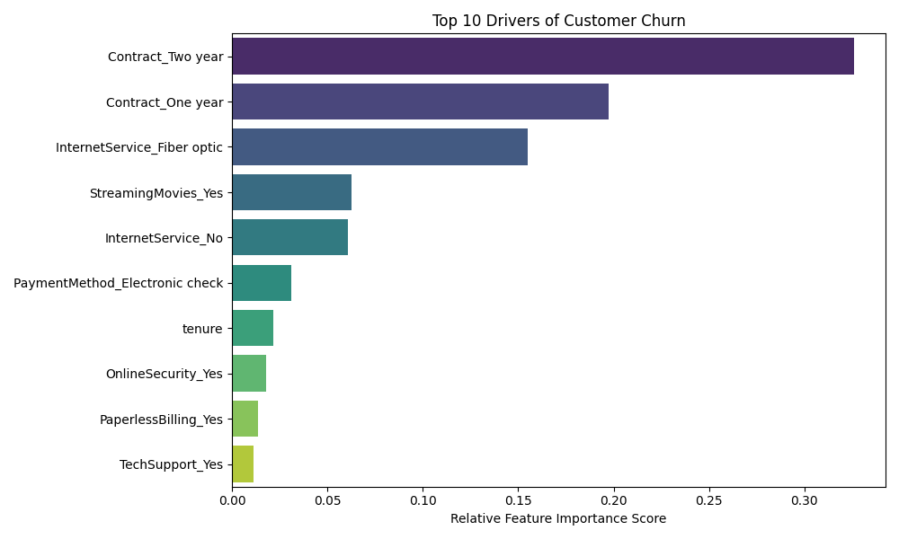

# Telecom Customer Churn Prediction

## Project Overview
This project builds a predictive machine learning pipeline using XGBoost to identify telecom subscribers at high risk of churning. 

## Key Results
* **Validation ROC-AUC:** 0.8414
* **Churn Recall Rate:** 79% (Optimized to capture maximum at-risk revenue)

## Top Churn Drivers
Below are the top features driving customer attrition, with contract type being the strongest indicator:

## Tech Stack
* Python (Google Colab)
* XGBoost
* Scikit-Learn
* Pandas / NumPy
* Matplotlib / Seaborn
